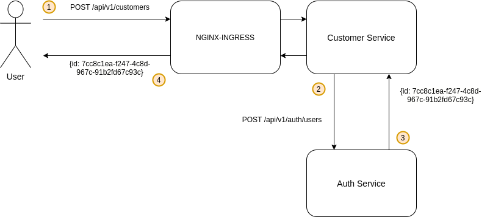
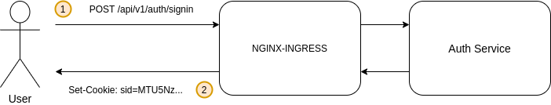
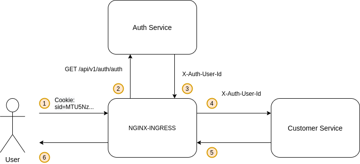

Демо приложение, реализующее cookie based аутентификацию и авторизацию для сервиса кастомеров.

#### Архитектура решения

##### Регистрация



##### Логин



##### Чтение, обновление данных кастомера




#### Установка приложения в Kubernetes

Чтобы мониторить метрики приложения, применим конфигмап для dashboard графаны и развернем Prometheus в namespace'е monitoring:

```
kubectl create namespace monitoring
helm install prom stable/prometheus-operator -f ./deploy/helm/monitoring/prometheus.yaml --atomic -n monitoring
```

Для мониторинга метрик БД установим postgres-exporter:

```
helm install postgre-metrics stable/prometheus-postgres-exporter -n monitoring
```

Создадим namespace для приложения и установим его в качестве текущего:

```
kubectl create namespace otus && kubectl config set-context --current --namespace=otus
```

Установим nginx ingress controller:

```
helm install nginx stable/nginx-ingress -f ./deploy/helm/nginx-ingress.yaml --atomic -n otus
```

Устанавливаем приложение:

````
make run
````

Убеждаемся, что все запущено:

```
$ kubectl get all

NAME                                                       READY   STATUS    RESTARTS   AGE
pod/auth-service-89b9d8bc5-wnvbp                           1/1     Running   2          11h
pod/auth-service-postgresql-0                              2/2     Running   0          11h
pod/customer-service-7cdb99857d-9gzdr                      1/1     Running   2          11h
pod/customer-service-7cdb99857d-j99h2                      1/1     Running   2          11h
pod/customer-service-7cdb99857d-j9n7k                      1/1     Running   2          11h
pod/customer-service-postgresql-0                          2/2     Running   0          11h
pod/nginx-nginx-ingress-controller-q2zgt                   1/1     Running   0          22h
pod/nginx-nginx-ingress-default-backend-679f548db6-52lfs   1/1     Running   0          22h

NAME                                             TYPE        CLUSTER-IP       EXTERNAL-IP   PORT(S)                      AGE
service/auth-service                             NodePort    10.96.180.227    <none>        9000:31073/TCP               11h
service/auth-service-postgresql                  ClusterIP   10.105.250.202   <none>        5432/TCP                     11h
service/auth-service-postgresql-headless         ClusterIP   None             <none>        5432/TCP                     11h
service/auth-service-postgresql-metrics          NodePort    10.107.66.246    <none>        9187:30225/TCP               11h
service/customer-service                         NodePort    10.109.116.112   <none>        9000:30124/TCP               11h
service/customer-service-postgresql              ClusterIP   10.110.0.157     <none>        5432/TCP                     11h
service/customer-service-postgresql-headless     ClusterIP   None             <none>        5432/TCP                     11h
service/customer-service-postgresql-metrics      NodePort    10.106.160.73    <none>        9187:32306/TCP               11h
service/nginx-nginx-ingress-controller           NodePort    10.110.216.95    <none>        80:31884/TCP,443:31264/TCP   22h
service/nginx-nginx-ingress-controller-metrics   ClusterIP   10.106.26.210    <none>        9913/TCP                     22h
service/nginx-nginx-ingress-default-backend      ClusterIP   10.101.90.62     <none>        80/TCP                       22h

NAME                                            DESIRED   CURRENT   READY   UP-TO-DATE   AVAILABLE   NODE SELECTOR   AGE
daemonset.apps/nginx-nginx-ingress-controller   1         1         1       1            1           <none>          22h

NAME                                                  READY   UP-TO-DATE   AVAILABLE   AGE
deployment.apps/auth-service                          1/1     1            1           11h
deployment.apps/customer-service                      3/3     3            3           11h
deployment.apps/nginx-nginx-ingress-default-backend   1/1     1            1           22h

NAME                                                             DESIRED   CURRENT   READY   AGE
replicaset.apps/auth-service-89b9d8bc5                           1         1         1       11h
replicaset.apps/customer-service-7cdb99857d                      3         3         3       11h
replicaset.apps/nginx-nginx-ingress-default-backend-679f548db6   1         1         1       22h

NAME                                           READY   AGE
statefulset.apps/auth-service-postgresql       1/1     11h
statefulset.apps/customer-service-postgresql   1/1     11h
```

После запуска сервис доступен по адресу http://arch.homework.

Для запуска end-2-end тестов, используя newman:

```
newman run ./test/api.v1.postman_collection.json
```

Для удаления приложения:

```
make remove
```

Для запуска Prometheus:

```
kubectl port-forward -n monitoring service/prom-prometheus-operator-prometheus 9090
```